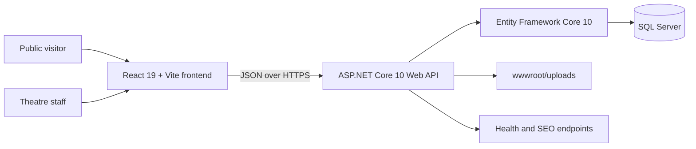

# Teatri AAB "Faruk Begolli" - Project Documentation

## 1. Project overview

This repository contains the official website and administration system for **Teatri AAB "Faruk Begolli"**. It is both a public-facing cultural website and an internal theatre-management application.

The public website presents the theatre, its repertoire, performances, news, photo galleries, and the Prishtina International Theatre Festival (PITF). Visitors can browse the site in Albanian or English, contact the theatre, subscribe to the newsletter, and reserve seats for performances that use internal booking.

The protected administration panel lets theatre staff manage the content and operational data shown on the public website. It includes show and performance scheduling, seating plans, reservations, customer records, news, PITF editions, galleries, media, static pages, navigation, users, audit activity, SEO checks, and system status.

## 2. Main users

### Public visitors

Visitors can:

- browse the website in Albanian (`sq`) or English (`en`);
- learn about the theatre and view theatre statistics;
- browse shows by category and open complete show details;
- see show credits, synopsis, posters, galleries, trailers, and performance dates;
- browse current and historical news;
- view PITF information and festival editions;
- explore the general theatre gallery;
- view upcoming performances and reserve tickets;
- send a contact message;
- subscribe to the newsletter.

### Theatre staff

Authenticated staff can:

- maintain bilingual website content;
- create, edit, publish, archive, restore, duplicate, and delete shows;
- define performers, production credits, categories, posters, videos, and galleries;
- schedule performances and maintain venues;
- use an external ticket URL or the built-in seat reservation workflow;
- create seating templates and customize a performance's seat layout;
- review and manage reservations, customers, seat blocks, and booking history;
- publish news, PITF editions, albums, and static pages;
- review contact messages and newsletter subscribers;
- manage uploaded media and see where an asset is used;
- review translation and SEO issues.

### Super administrators

Super administrators additionally control sensitive areas such as administrator accounts and roles, navigation/footer configuration, full activity logs, customer-data exports, theatre seating schemas, settings, and backup/system information.

## 3. Public website

The public React application uses language-prefixed URLs. Albanian is the default language.

| Area | Albanian route | English route | Purpose |
| --- | --- | --- | --- |
| Home | `/sq` | `/en` | Hero content, theatre introduction, statistics, upcoming shows, PITF preview, and reservation call to action |
| About | `/sq/per-ne` | `/en/about` | Theatre history, information, statistics, and gallery preview |
| Shows | `/sq/shfaqjet` | `/en/shows` | Published repertoire with categories and show details |
| News | `/sq/lajme` | `/en/news` | Searchable and paginated theatre news |
| PITF | `/sq/pitf` | `/en/pitf` | Festival information and edition archive |
| Gallery | `/sq/galeria` | `/en/gallery` | Public theatre photographs |
| Contact | `/sq/kontakti` | `/en/contact` | Contact details, location, map, and contact form |
| Reservations | `/sq/rezervo` | `/en/reserve` | Upcoming performances and ticket booking |

Show and news detail pages use translated slugs. The frontend also sets page metadata, canonical links, and language alternatives. The backend generates `robots.txt` and `sitemap.xml` from the configured public site URL and published content.

## 4. Shows and performances

A **show** represents a theatre production. It can contain:

- Albanian and English titles, slugs, summaries, full descriptions, and SEO metadata;
- a category, poster, featured image, gallery, trailer, and video;
- production year, duration, premiere date, age recommendation, and original language;
- cast and crew credits linked to people and credit types;
- editorial status: draft, published, archived, or cancelled;
- lifecycle status: upcoming, active, completed, or sold out;
- one or more scheduled performances.

A **performance** is a dated occurrence of a show. It stores its venue, hall, start/end time, publication and operational status, reservation rules, and internal notes. A background service updates performance status as dates pass.

Each performance supports one of two reservation modes:

1. **External URL**: the visitor is sent to an external ticket provider.
2. **Internal reservation**: the visitor chooses seats and completes the reservation inside this application.

## 5. Internal reservation workflow

The internal booking system is seat-based and designed to prevent two visitors from receiving the same seat.

1. An administrator assigns a seating template to a performance.
2. The application creates a performance-specific layout and individual seat records.
3. A visitor selects available seats.
4. The API temporarily holds those seats with an expiring token.
5. The visitor supplies a full name, phone number, and optional email address.
6. Before completion, the API checks the booking window, performance state, seat limit, hold ownership, and current availability again.
7. A customer, reservation, and active seat allocations are stored transactionally.

The system supports opening and closing times, pausing reservations, a maximum seat count per booking, disabled seats, administrator seat blocks, custom unavailable messages, and external ticket links. Phone numbers are normalized so repeat bookings can be associated with the same customer. A database-level filtered unique index protects each active seat from concurrent double booking.

Reservations can be unconfirmed or confirmed, and active, released, or cancelled. Changes preserve allocation and audit history instead of erasing the operational record. Staff can also make reservations on behalf of customers.

## 6. Administration panel

The admin application is available under `/admin` and uses the same React frontend and ASP.NET API.

| Module | Responsibility |
| --- | --- |
| Dashboard | Content summaries and recent operational information |
| Website Information | Theatre identity, contact details, social links, branding, and bilingual footer/theatre text |
| Homepage | Homepage sections, visibility, images, statistics, and calls to action |
| Translations | Missing Albanian or English content review |
| Shows | Production content, credits, media, publishing, duplication, and archiving |
| Performances | Scheduling, venues, conflicts, statuses, and reservation configuration |
| Reservations | Bookings, confirmation/status changes, seat management, exports, and audits |
| Customers | Customer search, reservation history, and privacy operations |
| Seating Templates | Reusable theatre layouts and performance-specific seat schemas |
| News | Authored articles, external coverage, related links, media, and galleries |
| PITF | Festival page and edition management |
| Gallery | General and content-related albums, ordering, visibility, and featured media |
| Static Pages | Bilingual managed pages |
| Messages | Contact inbox and message status management |
| Subscribers | Newsletter list and export |
| Media Library | Upload, replace, describe, find usage, and remove media assets |
| SEO Issues | Content quality and discoverability checks |
| Navigation/Footer | Managed public navigation and footer links |
| Users & Roles | Administrator accounts, activation, roles, and password reset |
| Activity Log | Filtered record of administrative actions |
| Backups & System | Health, backup metadata, and safe operational event summaries |
| Settings | Restricted system configuration |

## 7. Roles and security

There are two administrator roles:

- `ContentEditor`: manages day-to-day content and reservations.
- `SuperAdmin`: has full access, including users, settings, activity, schemas, exports, and other sensitive operations.

Authentication uses an HTTP-only cookie with strict same-site behavior and an eight-hour sliding session. Production cookies require HTTPS. The backend revalidates that the signed-in user still exists, is active, and retains the role stored in the session.

Additional protections include:

- named authorization policies on sensitive endpoints;
- login rate limiting of five attempts per five minutes per client IP;
- contact-form rate limiting of five submissions per ten minutes per client IP;
- origin checks for administrative requests;
- server-side HTML sanitization;
- MIME type and file-size validation for uploads;
- centralized error handling with correlation information;
- administrator and reservation audit records;
- production startup checks for HTTPS URL, allowed hosts, and CORS configuration;
- readiness and liveness health endpoints.

The first super administrator is bootstrapped only when no administrator exists and secure environment settings are supplied. No default administrator password is stored in source control.

## 8. Technical architecture



### Frontend

- React 19 and React Router 7
- Vite 8 build tooling
- Axios API client with credential support
- i18next for Albanian and English interface strings
- TipTap for rich-text administration fields
- responsive public pages and a separate protected admin layout
- browser history routing with a configurable deployment base path

### Backend

- ASP.NET Core targeting .NET 10
- controller-based JSON API
- Entity Framework Core with SQL Server
- cookie authentication and policy-based authorization
- Swagger UI in Development
- background services for seating initialization and performance status updates
- static serving of uploaded images, MP4 videos, and PDF documents
- ClosedXML for spreadsheet exports
- HtmlSanitizer for managed rich text

### Storage

The application has two persistent stores that must be backed up together:

1. The SQL Server database stores content, translations, schedules, users, reservations, customer information, settings, and audit history.
2. `backend/wwwroot/uploads` stores uploaded images, videos, and documents.

## 9. Important data areas

The main entity groups are:

- **Content**: shows, translations, categories, people, credits, news, PITF editions, static pages, and theatre information.
- **Scheduling**: performances, locations, statuses, dates, halls, and reservation configuration.
- **Media**: reusable media assets, translated metadata, galleries, album media, ordering, and featured images.
- **Reservations**: seating templates, sections, rows, seats, performance layouts, temporary holds, customers, reservations, allocations, and audit events.
- **Communication**: contact messages and newsletter subscribers.
- **Administration**: admin users, roles, activity records, settings, and operational events.

Translations are first-class database records rather than duplicated pages. Public content is selected using the `sq` or `en` language code.

## 10. Repository structure

```text
teatri_aab/
|-- backend/                 ASP.NET Core API
|   |-- Controllers/         Public and protected API endpoints
|   |-- Data/                DbContext, EF configuration, and seed/import logic
|   |-- DTOs/                API request and response contracts
|   |-- Middleware/          Error, origin, and activity handling
|   |-- Migrations/          Entity Framework database migrations
|   |-- Models/              Domain/database entities and enums
|   |-- Services/            Business and infrastructure services
|   `-- wwwroot/uploads/     Persistent uploaded media
|-- backend.Tests/           Backend unit and integration-style tests
|-- frontend/                React public website and admin panel
|   |-- public/              Public files and demo media
|   |-- src/admin/           Protected administration application
|   |-- src/api/             Public API client modules
|   |-- src/components/      Shared and public UI components
|   |-- src/pages/           Public route pages
|   `-- tests/               Frontend domain-rule tests
|-- docs/                    Project and operations documentation
|-- scripts/                 Operational scripts, including backup automation
`-- Theatre.sln             .NET solution
```

## 11. Local development setup

### Prerequisites

- .NET 10 SDK
- Node.js version supported by Vite 8 and npm
- SQL Server or SQL Server Express
- EF Core CLI (`dotnet-ef`) when manually managing migrations

### Database and backend

The development configuration expects SQL Server Express at `localhost\SQLEXPRESS` and database `TheatreAab`. Change `ConnectionStrings:DefaultConnection` in local configuration when necessary.

From the repository root:

```powershell
dotnet restore Theatre.sln
dotnet run --project backend/Theatre.Api.csproj --urls http://localhost:5000
```

In Development, the backend applies pending migrations automatically. Development demo data is added only when `Seed:EnableDevelopmentSeed` is `true`.

To create the first administrator, set these environment variables before the first backend start:

```text
AdminBootstrap__Email=admin@example.com
AdminBootstrap__Password=<unique password with at least 12 characters>
AdminBootstrap__DisplayName=Theatre Administrator
```

Remove the bootstrap password from the process environment after the account has been created.

The Development Swagger interface is exposed at `http://localhost:5000/swagger`.

### Frontend

Create `frontend/.env` from `frontend/.env.example`, then run:

```powershell
cd frontend
npm install
npm run dev
```

The default frontend API setting is:

```text
VITE_API_BASE_URL=http://localhost:5000
```

Vite normally serves the site at `http://localhost:5173`. The backend development CORS list allows both `localhost:5173` and `127.0.0.1:5173`.

## 12. Build and test commands

Run backend tests:

```powershell
dotnet test Theatre.sln
```

Build the backend release:

```powershell
dotnet build backend/Theatre.Api.csproj --configuration Release
```

Run frontend rule tests and linting:

```powershell
cd frontend
npm test
npm run lint
```

Build the production frontend:

```powershell
npm run build
```

Backend tests cover reservation behavior, authentication and authorization, uploads, newsletter/contact-related services, homepage data, phone normalization, and seating layouts. Frontend tests currently focus on public reservation selection rules.

## 13. Configuration reference

| Setting | Purpose |
| --- | --- |
| `ConnectionStrings:DefaultConnection` | SQL Server connection string; required in every environment |
| `Cors:AllowedOrigins` | Exact frontend/admin origins permitted to call the API with credentials |
| `PublicSite:BaseUrl` | Final absolute public HTTPS origin used by SEO output |
| `PublicSite:BasePath` | Optional application path when deployed below a domain root |
| `Uploads:MaxBytes` | Maximum upload size; default is 20 MB and startup validation caps it at 50 MB |
| `Uploads:AllowedMimeTypes` | Accepted image, video, and document content types |
| `BackupStatus:*` | Backup provider and latest database/media backup timestamps shown to administrators |
| `AllowedHosts` | Accepted production host names |
| `Seed:EnableDevelopmentSeed` | Enables demo data in Development only |
| `VITE_API_BASE_URL` | Backend origin used by the browser application |

Production secrets and connection strings should be supplied through environment variables or protected server configuration and must not be committed.

## 14. Deployment and operations

Production startup intentionally fails when the public HTTPS URL, allowed hosts, database connection, or production CORS configuration is unsafe or incomplete.

Important deployment requirements:

- build the frontend with its correct Vite base path;
- configure the web server to return `index.html` for React routes;
- keep `/api`, `/uploads`, `/robots.txt`, and `/sitemap.xml` mapped to real backend resources;
- terminate HTTPS at IIS or an approved reverse proxy;
- forward `X-Forwarded-For` and `X-Forwarded-Proto` only from trusted proxies;
- apply reviewed EF migrations as a controlled deployment step;
- preserve and deploy the uploads directory independently of compiled application files;
- monitor `/health/live` for process health and `/health/ready` for API plus database readiness.

Do not depend on the Development-only automatic migration behavior in production.

## 15. Backup and recovery

The repository includes `scripts/backup-teatri.ps1`, which creates and verifies a SQL Server backup, archives uploaded media, and writes SHA-256 hashes.

Example:

```powershell
.\scripts\backup-teatri.ps1 -SqlServer "localhost\SQLEXPRESS" -Database "TheatreAab" -OutputRoot "E:\TeatriBackups"
```

Back up both the database and uploads daily, keep an encrypted off-site copy, monitor failures and free space, and perform a restore drill into a separate environment at least quarterly. Restoration is an infrastructure procedure and is deliberately not performed from the admin panel.

## 16. Health, logging, and auditability

- `GET /health/live` confirms that the API process responds.
- `GET /health/ready` also checks database connectivity.
- Development exposes Swagger documentation.
- Errors are converted to safe API responses while detailed diagnostics remain server-side.
- Administrative changes and reservation operations have dedicated audit records.
- The admin system page exposes safe summaries and correlation identifiers rather than raw exception details.

## 17. Current considerations

- The frontend's Vite base is currently `/Teatri_AAB_Faruk_Begolli/`; change it when deploying at a different path or at the domain root.
- Uploaded media and the SQL database form one logical dataset and must remain synchronized during backup, restore, and deployment.
- Public reservations collect personal data. Production access, exports, logs, and backups should follow the theatre's privacy and retention policy.
- Translation and SEO review tools help identify content problems, but editorial review is still required before publishing.
- The code includes bundled/demo media fallbacks for frontend demonstrations; production should use backend-managed published content and media.

## 18. Related documentation

- [`PRODUCTION_READINESS.md`](./PRODUCTION_READINESS.md) - production configuration and release checklist
- [`BACKUP_AND_SEO.md`](./BACKUP_AND_SEO.md) - backup schedule, recovery guidance, and SEO deployment notes
- [`ADMIN_FOUNDATION.md`](./ADMIN_FOUNDATION.md) - background on the original admin authentication and architecture foundation

## 19. Summary

Teatri AAB is a complete bilingual theatre publishing and operations platform. Its public side promotes the theatre and its cultural programme; its administration side lets staff maintain that programme and operate reservations without editing code. The ASP.NET Core API enforces the business rules and security boundaries, SQL Server stores structured and translated data, and the React application provides both the visitor and staff interfaces.
